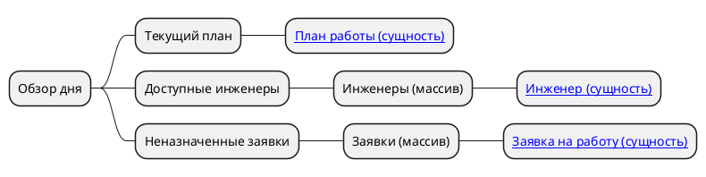
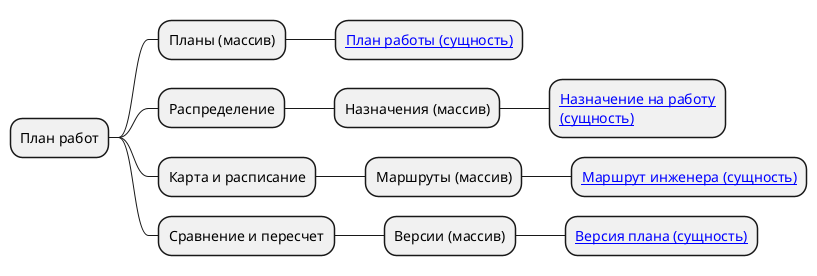
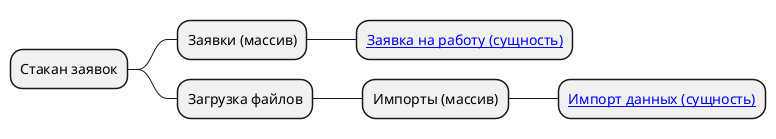
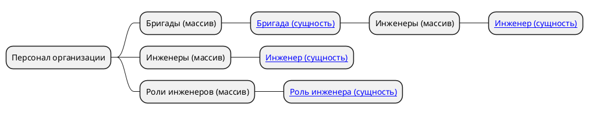
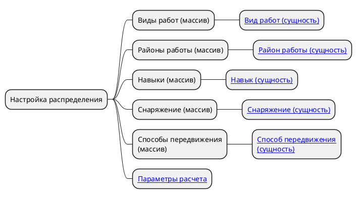

# Навигация

Нажмите на сущность на карте, чтобы открыть ее описание.

## Обзор дня

```plantuml-svg
@startmindmap
<style>
node {
  MaximumWidth 220
}
</style>
* Обзор дня
** Текущий план
*** [[01%20%D0%9D%D0%B0%D0%B2%D0%B8%D0%B3%D0%B0%D1%86%D0%B8%D1%8F%2F02%20%D0%9F%D0%BB%D0%B0%D0%BD%D0%B8%D1%80%D0%BE%D0%B2%D0%B0%D0%BD%D0%B8%D0%B5%2F%D0%9F%D0%BB%D0%B0%D0%BD%20%D1%80%D0%B0%D0%B1%D0%BE%D1%82%D1%8B План работы (сущность)]]
** Доступные инженеры
*** Инженеры (массив)
**** [[01%20%D0%9D%D0%B0%D0%B2%D0%B8%D0%B3%D0%B0%D1%86%D0%B8%D1%8F%2F03%20%D0%9F%D0%B5%D1%80%D1%81%D0%BE%D0%BD%D0%B0%D0%BB%2F%D0%98%D0%BD%D0%B6%D0%B5%D0%BD%D0%B5%D1%80 Инженер (сущность)]]
** Неназначенные заявки
*** Заявки (массив)
**** [[01%20%D0%9D%D0%B0%D0%B2%D0%B8%D0%B3%D0%B0%D1%86%D0%B8%D1%8F%2F01%20%D0%97%D0%B0%D1%8F%D0%B2%D0%BA%D0%B8%2F%D0%97%D0%B0%D1%8F%D0%B2%D0%BA%D0%B0%20%D0%BD%D0%B0%20%D1%80%D0%B0%D0%B1%D0%BE%D1%82%D1%83 Заявка на работу (сущность)]]
@endmindmap
```

## План работ

```plantuml-svg
@startmindmap
<style>
node {
  MaximumWidth 220
}
</style>
* План работ
** Планы (массив)
*** [[01%20%D0%9D%D0%B0%D0%B2%D0%B8%D0%B3%D0%B0%D1%86%D0%B8%D1%8F%2F02%20%D0%9F%D0%BB%D0%B0%D0%BD%D0%B8%D1%80%D0%BE%D0%B2%D0%B0%D0%BD%D0%B8%D0%B5%2F%D0%9F%D0%BB%D0%B0%D0%BD%20%D1%80%D0%B0%D0%B1%D0%BE%D1%82%D1%8B План работы (сущность)]]
** Распределение
*** Назначения (массив)
**** [[01%20%D0%9D%D0%B0%D0%B2%D0%B8%D0%B3%D0%B0%D1%86%D0%B8%D1%8F%2F02%20%D0%9F%D0%BB%D0%B0%D0%BD%D0%B8%D1%80%D0%BE%D0%B2%D0%B0%D0%BD%D0%B8%D0%B5%2F%D0%9D%D0%B0%D0%B7%D0%BD%D0%B0%D1%87%D0%B5%D0%BD%D0%B8%D0%B5%20%D0%BD%D0%B0%20%D1%80%D0%B0%D0%B1%D0%BE%D1%82%D1%83 Назначение на работу (сущность)]]
** Карта и расписание
*** Маршруты (массив)
**** [[01%20%D0%9D%D0%B0%D0%B2%D0%B8%D0%B3%D0%B0%D1%86%D0%B8%D1%8F%2F02%20%D0%9F%D0%BB%D0%B0%D0%BD%D0%B8%D1%80%D0%BE%D0%B2%D0%B0%D0%BD%D0%B8%D0%B5%2F%D0%9C%D0%B0%D1%80%D1%88%D1%80%D1%83%D1%82%20%D0%B8%D0%BD%D0%B6%D0%B5%D0%BD%D0%B5%D1%80%D0%B0 Маршрут инженера (сущность)]]
** Сравнение и пересчет
*** Версии (массив)
**** [[01%20%D0%9D%D0%B0%D0%B2%D0%B8%D0%B3%D0%B0%D1%86%D0%B8%D1%8F%2F02%20%D0%9F%D0%BB%D0%B0%D0%BD%D0%B8%D1%80%D0%BE%D0%B2%D0%B0%D0%BD%D0%B8%D0%B5%2F%D0%92%D0%B5%D1%80%D1%81%D0%B8%D1%8F%20%D0%BF%D0%BB%D0%B0%D0%BD%D0%B0 Версия плана (сущность)]]
@endmindmap
```

## Стакан заявок

```plantuml-svg
@startmindmap
<style>
node {
  MaximumWidth 220
}
</style>
* Стакан заявок
** Заявки (массив)
*** [[01%20%D0%9D%D0%B0%D0%B2%D0%B8%D0%B3%D0%B0%D1%86%D0%B8%D1%8F%2F01%20%D0%97%D0%B0%D1%8F%D0%B2%D0%BA%D0%B8%2F%D0%97%D0%B0%D1%8F%D0%B2%D0%BA%D0%B0%20%D0%BD%D0%B0%20%D1%80%D0%B0%D0%B1%D0%BE%D1%82%D1%83 Заявка на работу (сущность)]]
** Загрузка файлов
*** Импорты (массив)
**** [[01%20%D0%9D%D0%B0%D0%B2%D0%B8%D0%B3%D0%B0%D1%86%D0%B8%D1%8F%2F01%20%D0%97%D0%B0%D1%8F%D0%B2%D0%BA%D0%B8%2F%D0%98%D0%BC%D0%BF%D0%BE%D1%80%D1%82%20%D0%B4%D0%B0%D0%BD%D0%BD%D1%8B%D1%85 Импорт данных (сущность)]]
@endmindmap
```

## Персонал организации

```plantuml-svg
@startmindmap
<style>
node {
  MaximumWidth 220
}
</style>
* Персонал организации
** Бригады (массив)
*** [[01%20%D0%9D%D0%B0%D0%B2%D0%B8%D0%B3%D0%B0%D1%86%D0%B8%D1%8F%2F03%20%D0%9F%D0%B5%D1%80%D1%81%D0%BE%D0%BD%D0%B0%D0%BB%2F%D0%91%D1%80%D0%B8%D0%B3%D0%B0%D0%B4%D0%B0 Бригада (сущность)]]
**** Инженеры (массив)
***** [[01%20%D0%9D%D0%B0%D0%B2%D0%B8%D0%B3%D0%B0%D1%86%D0%B8%D1%8F%2F03%20%D0%9F%D0%B5%D1%80%D1%81%D0%BE%D0%BD%D0%B0%D0%BB%2F%D0%98%D0%BD%D0%B6%D0%B5%D0%BD%D0%B5%D1%80 Инженер (сущность)]]
** Инженеры (массив)
*** [[01%20%D0%9D%D0%B0%D0%B2%D0%B8%D0%B3%D0%B0%D1%86%D0%B8%D1%8F%2F03%20%D0%9F%D0%B5%D1%80%D1%81%D0%BE%D0%BD%D0%B0%D0%BB%2F%D0%98%D0%BD%D0%B6%D0%B5%D0%BD%D0%B5%D1%80 Инженер (сущность)]]
** Роли инженеров (массив)
*** [[01%20%D0%9D%D0%B0%D0%B2%D0%B8%D0%B3%D0%B0%D1%86%D0%B8%D1%8F%2F03%20%D0%9F%D0%B5%D1%80%D1%81%D0%BE%D0%BD%D0%B0%D0%BB%2F%D0%A0%D0%BE%D0%BB%D1%8C%20%D0%B8%D0%BD%D0%B6%D0%B5%D0%BD%D0%B5%D1%80%D0%B0 Роль инженера (сущность)]]
@endmindmap
```

## Настройка распределения

```plantuml-svg
@startmindmap
<style>
node {
  MaximumWidth 220
}
</style>
* Настройка распределения
** Виды работ (массив)
*** [[01%20%D0%9D%D0%B0%D0%B2%D0%B8%D0%B3%D0%B0%D1%86%D0%B8%D1%8F%2F04%20%D0%A1%D0%BF%D1%80%D0%B0%D0%B2%D0%BE%D1%87%D0%BD%D0%B8%D0%BA%D0%B8%2F%D0%92%D0%B8%D0%B4%20%D1%80%D0%B0%D0%B1%D0%BE%D1%82 Вид работ (сущность)]]
** Районы работы (массив)
*** [[01%20%D0%9D%D0%B0%D0%B2%D0%B8%D0%B3%D0%B0%D1%86%D0%B8%D1%8F%2F04%20%D0%A1%D0%BF%D1%80%D0%B0%D0%B2%D0%BE%D1%87%D0%BD%D0%B8%D0%BA%D0%B8%2F%D0%A0%D0%B0%D0%B9%D0%BE%D0%BD%20%D1%80%D0%B0%D0%B1%D0%BE%D1%82%D1%8B Район работы (сущность)]]
** Навыки (массив)
*** [[01%20%D0%9D%D0%B0%D0%B2%D0%B8%D0%B3%D0%B0%D1%86%D0%B8%D1%8F%2F04%20%D0%A1%D0%BF%D1%80%D0%B0%D0%B2%D0%BE%D1%87%D0%BD%D0%B8%D0%BA%D0%B8%2F%D0%9D%D0%B0%D0%B2%D1%8B%D0%BA Навык (сущность)]]
** Снаряжение (массив)
*** [[01%20%D0%9D%D0%B0%D0%B2%D0%B8%D0%B3%D0%B0%D1%86%D0%B8%D1%8F%2F04%20%D0%A1%D0%BF%D1%80%D0%B0%D0%B2%D0%BE%D1%87%D0%BD%D0%B8%D0%BA%D0%B8%2F%D0%A1%D0%BD%D0%B0%D1%80%D1%8F%D0%B6%D0%B5%D0%BD%D0%B8%D0%B5 Снаряжение (сущность)]]
** Способы передвижения (массив)
*** [[01%20%D0%9D%D0%B0%D0%B2%D0%B8%D0%B3%D0%B0%D1%86%D0%B8%D1%8F%2F04%20%D0%A1%D0%BF%D1%80%D0%B0%D0%B2%D0%BE%D1%87%D0%BD%D0%B8%D0%BA%D0%B8%2F%D0%A1%D0%BF%D0%BE%D1%81%D0%BE%D0%B1%20%D0%BF%D0%B5%D1%80%D0%B5%D0%B4%D0%B2%D0%B8%D0%B6%D0%B5%D0%BD%D0%B8%D1%8F Способ передвижения (сущность)]]
** [[01%20%D0%9D%D0%B0%D0%B2%D0%B8%D0%B3%D0%B0%D1%86%D0%B8%D1%8F%2F02%20%D0%9F%D0%BB%D0%B0%D0%BD%D0%B8%D1%80%D0%BE%D0%B2%D0%B0%D0%BD%D0%B8%D0%B5%2F%D0%9F%D0%B0%D1%80%D0%B0%D0%BC%D0%B5%D1%82%D1%80%D1%8B%20%D1%80%D0%B0%D1%81%D1%87%D0%B5%D1%82%D0%B0 Параметры расчета]]
@endmindmap
```
